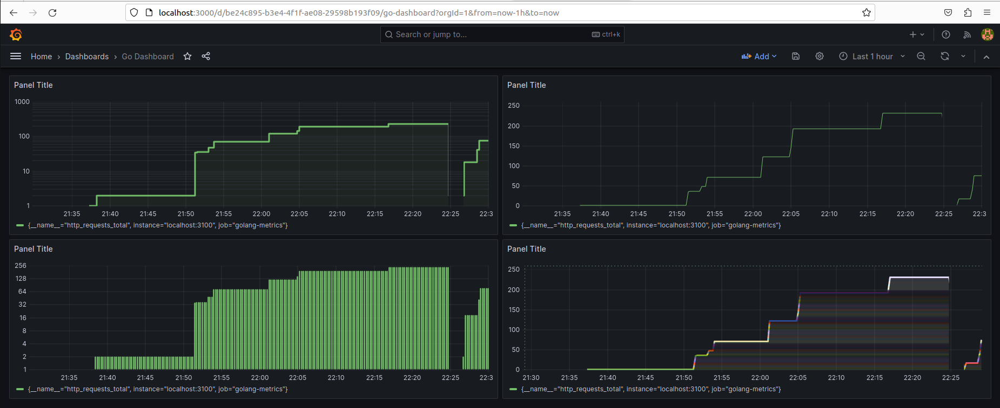

# prometheus-first-project
A practice project to learn prometheus.

### Set up a go project
- Create a basic html file to print Hello World.
- Create a prometheus endpoint using promtheus/promhttp module.This will automatically expose some built-in metrics.
- Create a httpRequests counter variable which will be incremented whenever :3000/ endpoint will be  accessed.

### To enable prometheus on linux server.

Follow this [tutorial](https://www.cherryservers.com/blog/install-prometheus-ubuntu)

### Link Grafana with Prometheus

Follow this [tutorial](https://www.linode.com/docs/guides/how-to-install-prometheus-and-grafana-on-ubuntu/#how-to-install-and-deploy-the-grafana-server)

###  Graph of total http requests to localhost:3100/

### References 

- [Collecting Prometheus Metrics](https://gabrieltanner.org/blog/collecting-prometheus-metrics-in-golang/)
